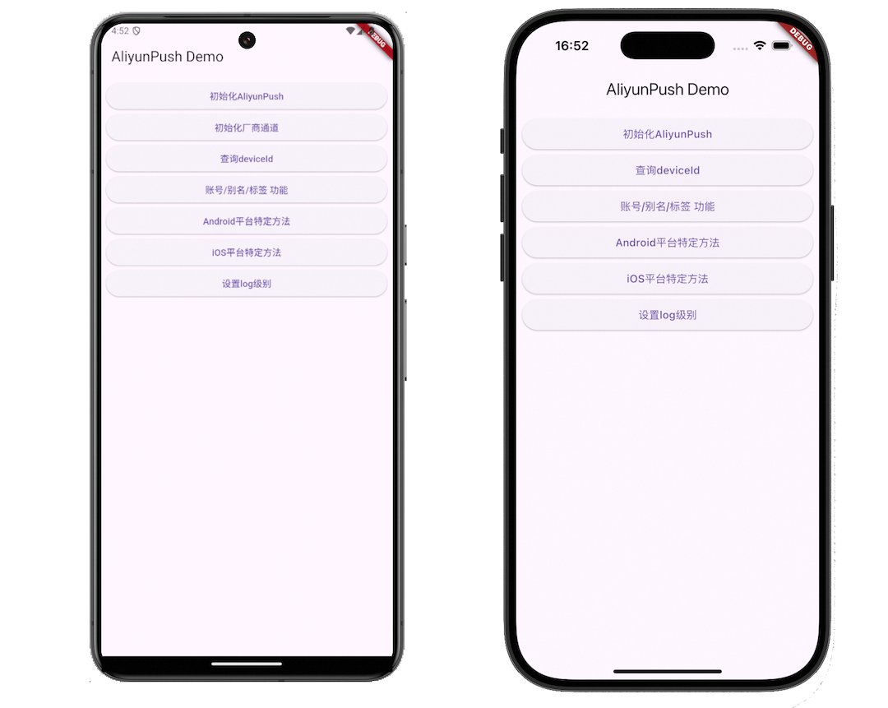

# Aliyun Flutter Push Example



这是一个[**Flutter**](https://flutter.dev/)项目

## 快速入门

>**注意**：在开始之前，请确保您已完成 [环境配置](https://docs.flutter.cn/get-started/install)。

### 步骤 1：构建并运行您的应用

在项目根目录下打开一个新的终端窗口/面板，并使用一下命令之一来构建并运行您的 Android 或 iOS 应用：

#### 检查环境

```sh
flutter doctor# 检查环境配置
flutter devices# 查看可用设备
```

#### 运行到Android

模拟器运行：

```sh
# 启动Android模拟器
#1. 查看可用Android模拟器
flutter emulators
# 2. 启动Android模拟器
flutter emulators --launch Pixel_7_API_34
# 然后执行：
flutter run
# 或指定设备：
flutter run -d emulator Pixel_7_API_34
```

真机运行：

```sh
#连接Android手机
# 开启USB调试
# 然后执行：
flutter run
# 或：
flutter run -d<device-id>
```

#### 运行到iOS

模拟器运行：

```sh
# 启动iOS模拟器
open -a Simulator
# 运行Flutter应用
flutter run
```

真机运行：

```sh
#连接iPhone
# 信任开发者证书
# 然后执行：
flutter run
```

#### 快速选择设备

如果你想快速选择设备，直接运行：

```sh
flutter run
```
Flutter会列出所有可用设备，然后你可以输入数字来选择：
```
Multiple devices found:
[1]: sdk gphone64arm64 (emulator-5554)
[2]: iPhone 16Pro (26750A6A-0380-4703-91CD-855FFC1E0C27)
[3]: macOS (macos)
[4]: Chrome (chrome)
Please choose one (or "q" to quit): 
```
输入'2'就会运行到iPhone 16 Pro模拟器。

>**设置默认设备（可选）** 
你也可以在VS Code或Android Studio中设置默认设备，这样每次运行时就会自动使用指定的设备。

### 步骤 2：修改您的应用

成功运行应用后，让我们来修改它！

在您喜欢的文本编辑器中打开 `main.dart` 并进行一些更改。保存后，使用[热重载功能](https://docs.flutter.cn/tools/hot-reload)(终端窗口/面板中按’r‘键)来更新应用以反映这些更改。
更多Flutter命令如下：

```
Flutter run key commands.
r Hot reload. 🔥🔥🔥
R Hot restart.
h List all available interactive commands.
d Detach (terminate "flutter run" but leave application running).
c Clear the screen
q Quit (terminate the application on the device).
```

## 恭喜！ :tada:

您已成功运行并修改了您的 Flutter 应用！ :partying_face:

### 下一步？

- 如果您想将 Flutter 代码集成到现有应用中，请查看 [集成指南](https://docs.flutter.cn/add-to-app)。
- 如果您想深入了解 Flutter，请查看 [官方文档](https://docs.flutter.cn/get-started/learn-flutter)。

## 故障排查

- 如果您在上述步骤中遇到问题，请参阅 [安装常见问题](https://docs.flutter.cn/install/troubleshoot)页面。
- 如果您有更多其他问题，请参阅 [常见问题与解答](https://docs.flutter.cn/resources/faq) 页面。

## 了解更多

要深入了解 Flutter，请查看以下资源：

- [Flutter 官网](https://flutter.dev/) - 了解更多关于 Flutter 的信息。
- [Flutter 开发文档](https://docs.flutter.cn/) - Flutter 安装及开发文档。
- [Flutter 中文社区](https://flutter.cn/community/) - Flutter中文开发者的技术成长和交流hub。
- [`@flutter/flutter`](https://github.com/flutter/flutter) - Flutter 的开源 GitHub 仓库。